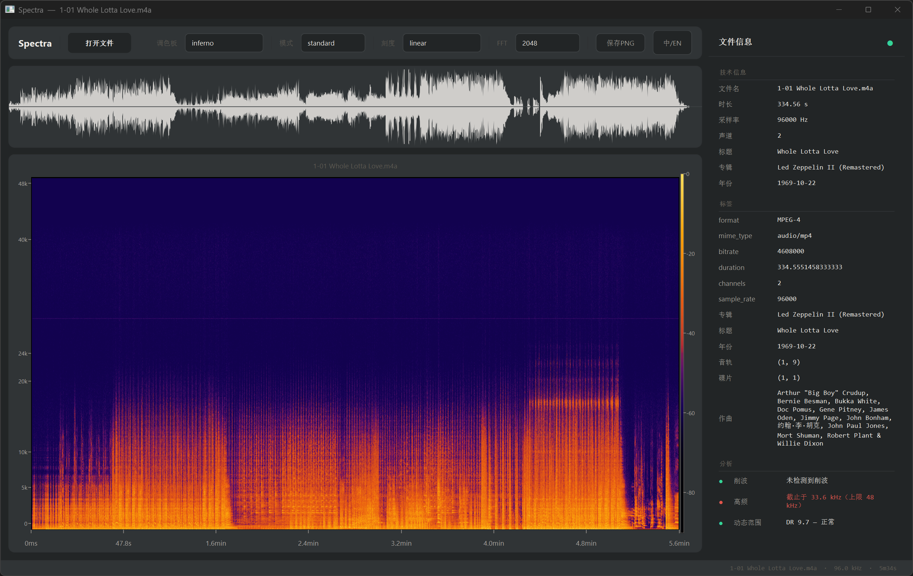

# Spectra
A modern spectrogram analyzer for music enthusiasts and HiFi listeners
# Spectra


A GPU-accelerated audio spectrogram analyzer with a Claude-inspired dark UI.
Drag in a file, see its spectrum, waveform, and quality diagnostics instantly.

GPU 加速的音频频谱分析器，Claude 风格深色界面。拖入文件即可查看频谱、波形和质量诊断。

## Features · 功能

- **GPU spectrogram** — OpenGL fragment shader with multiple colormaps (inferno, viridis, plasma, magma, RX)
- **Quality analysis** — clipping detection, upsampling check, dynamic range (DR), peak/RMS, frequency roll-off
- **Multi-resolution STFT** — standard, multi-band, and phase-reassigned modes
- **Flexible Y-axis** — linear, logarithmic, mel, and bark scales
- **Waveform preview** — down-sampled envelope with mirrored fill
- **Drag & drop** — WAV, FLAC, MP3, M4A, OGG, AAC, OPUS, APE, DSD, and more
- **Colormap-synced colorbar** — dB scale gradient that tracks the active palette
- **Bilingual UI** — Chinese / English toggle in the toolbar
- **Screenshot export** — save the current spectrogram view as PNG

> **GPU 频谱** — OpenGL 片段着色器，支持多种色板（inferno、viridis、plasma、magma、RX）
> **质量分析** — 削波检测、升频检测、动态范围、峰值/RMS、频率截止
> **多分辨率 STFT** — 标准、多频段、相位重分配三种模式
> **灵活的 Y 轴** — 线性、对数、mel、bark 四种频率刻度
> **波形预览** — 降采样包络镜像填充
> **拖放加载** — 支持 WAV、FLAC、MP3、M4A、OGG、AAC、OPUS、APE、DSD 等格式
> **色条联动** — dB 渐变色条随色板同步更新
> **双语界面** — 工具栏一键切换中文/英文
> **截图导出** — 保存当前频谱视图为 PNG

## Quick Start · 快速启动

```
pip install pyqt6 numpy librosa pyfftw matplotlib av
python main.py
```

Drag an audio file into the window, or click **Open File** (打开文件).

拖入音频文件，或点击 **打开文件** 按钮。

## Supported Formats · 支持格式

| Format | Extension |
|--------|-----------|
| FLAC | `.flac` |
| WAV | `.wav` |
| MP3 | `.mp3` |
| M4A / ALAC | `.m4a` `.mp4` |
| AAC | `.aac` |
| Monkey's Audio | `.ape` |

## Colormaps · 色板

| Name | Description |
|------|-------------|
| `inferno` | Perceptually uniform, warm |
| `viridis` | Perceptually uniform, blue-green-yellow |
| `plasma` | Perceptually uniform, purple-orange-yellow |
| `magma` | Perceptually uniform, dark-purple-yellow |
| `cividis` | Perceptually uniform, blue-yellow (colorblind-safe) |
| `rx` | iZotope RX style — black → cyan → orange → white |
| `hot` | Black → red → yellow |

## Project Structure · 项目结构

```
spectra/
├── main.py                    # Entry point / 入口
├── lang.py                    # Bilingual (zh/en) toggle / 双语切换
├── analyzer/
│   ├── core.py                # AudioAnalyzer: load, STFT, quality
│   ├── load.py                # PyAV / ffmpeg decoder
│   ├── metadata.py            # Tag extraction / 标签提取
│   └── spectrogram.py         # Matplotlib fallback + palettes
├── ui/
│   ├── main_window.py         # Main window, toolbar, layout, workers
│   ├── spectrogram_widget.py  # QOpenGLWidget GPU renderer + axis widgets
│   ├── waveform_widget.py     # Waveform envelope display / 波形显示
│   ├── metadata_panel.py      # File info + quality analysis panel
│   └── styles.py              # Claude-inspired color tokens / 配色令牌
└── tests/
    └── test_main_window.py
```

## License · 许可证

MIT

---

*Built with PyQt6, OpenGL, and librosa.*
